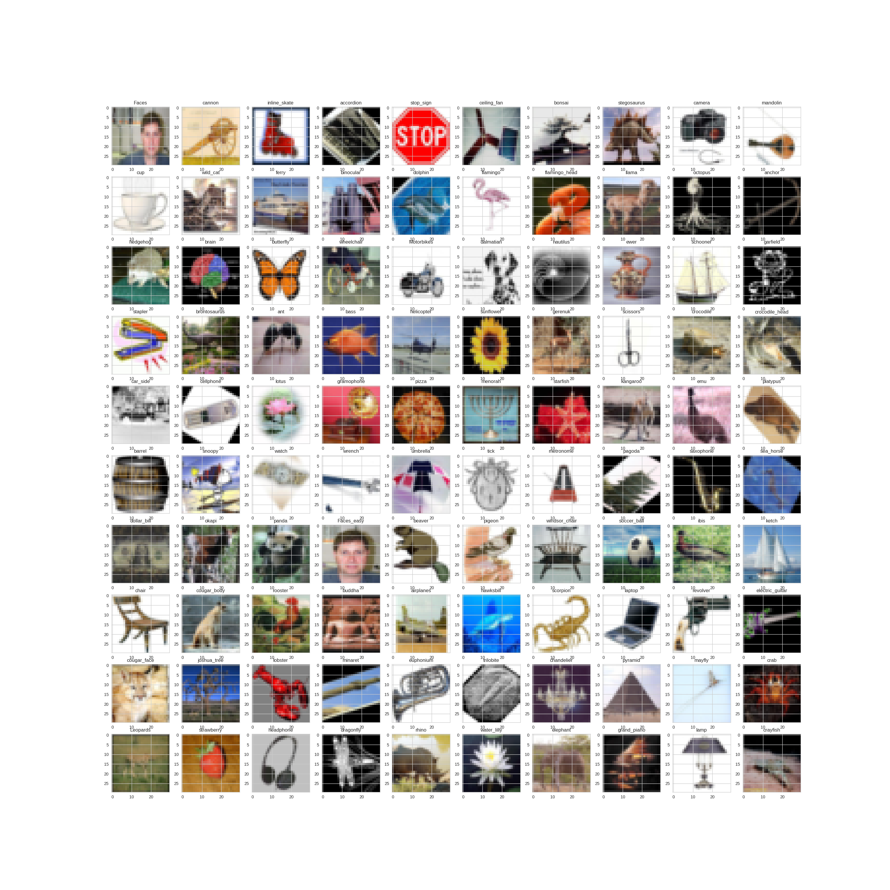
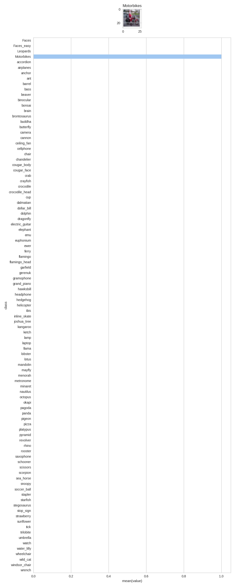
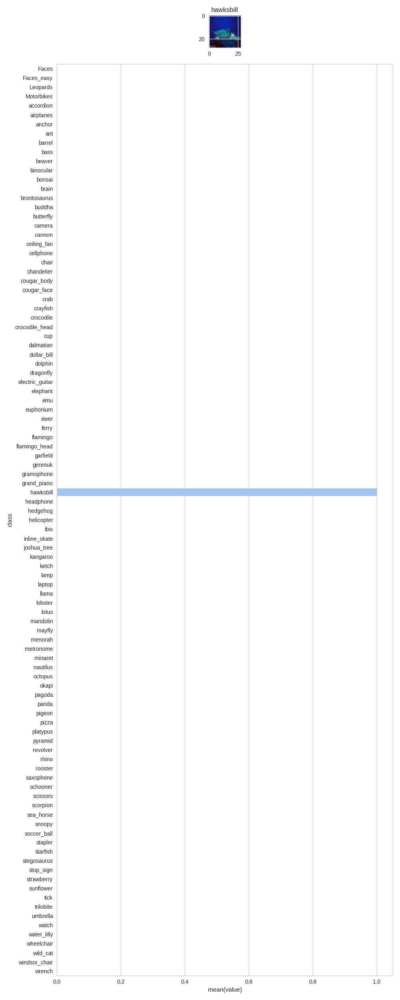
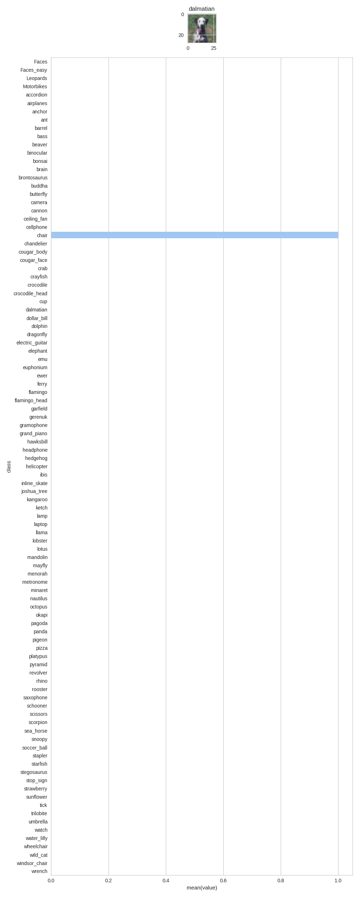
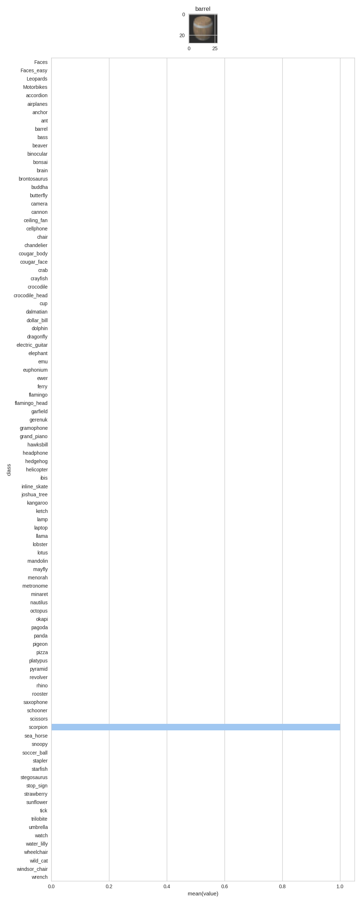
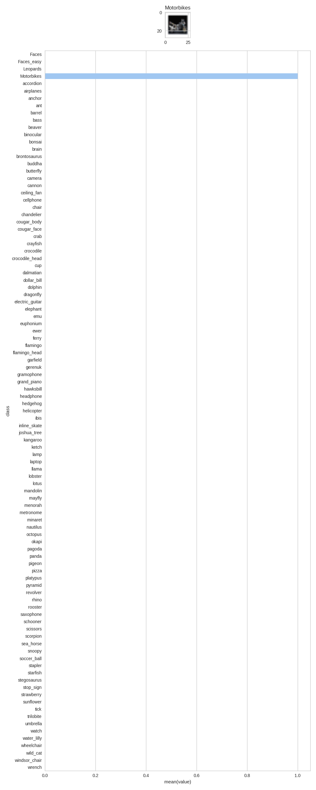

# Image-Recognition-using-CNN
This repository introduction to Convolutional Neural Network with dropout and l2 loss to detect 100 classes of images

## [Dataset download from here](http://www.vision.caltech.edu/Image_Datasets/Caltech101/)
It contains 102 of picture categories, consist more than 8k pictures.

## You need to configure settings in settings.py
```python
location = '/home/project/101_ObjectCategories/'
current_location = os.getcwd()
picture_dimension = 28
learning_rate = 0.01

enable_dropout = False
dropout_probability = 1.0

enable_penalty = False
penalty = 0.0005
batch_size = 20
epoch = 1000

split_percentage = 0.2

Train = False

test_number = 10
```



The model works perfectly. This is the lost and accuracy function after 20 epoch only


after 200 epoch only


```text
accuracy for 1 batch: 0.55
accuracy for 21 batch: 0.7
accuracy for 41 batch: 0.85
accuracy for 61 batch: 0.75
accuracy for 81 batch: 0.75
accuracy for 101 batch: 0.7
accuracy for 121 batch: 0.75
accuracy for 141 batch: 0.75
accuracy for 161 batch: 0.75
accuracy for 181 batch: 0.7
accuracy for 201 batch: 0.65
accuracy for 221 batch: 0.7
accuracy for 241 batch: 0.7
accuracy for 261 batch: 0.7
accuracy for 281 batch: 0.7
accuracy for 301 batch: 0.8
accuracy for 321 batch: 0.75
accuracy for 341 batch: 0.85
accuracy for 361 batch: 0.7
accuracy for 381 batch: 0.7
accuracy for 401 batch: 0.75
accuracy for 421 batch: 0.8
accuracy for 441 batch: 0.85
accuracy for 461 batch: 0.75
accuracy for 481 batch: 0.7
accuracy for 501 batch: 0.9
accuracy for 521 batch: 0.8
accuracy for 541 batch: 0.8
accuracy for 561 batch: 0.75
accuracy for 581 batch: 0.7
accuracy for 601 batch: 0.7
accuracy for 621 batch: 0.65
accuracy for 641 batch: 0.85
accuracy for 661 batch: 0.7
accuracy for 681 batch: 0.65
accuracy for 701 batch: 0.85
accuracy for 721 batch: 0.65
accuracy for 741 batch: 0.85
accuracy for 761 batch: 0.7
accuracy for 781 batch: 0.65
accuracy for 801 batch: 0.9
accuracy for 821 batch: 0.8
accuracy for 841 batch: 0.75
accuracy for 861 batch: 0.75
accuracy for 881 batch: 0.9
accuracy for 901 batch: 0.7
accuracy for 921 batch: 0.75
accuracy for 941 batch: 0.85
accuracy for 961 batch: 0.8
accuracy for 981 batch: 0.65
accuracy for 1001 batch: 0.75
accuracy for 1021 batch: 0.75
accuracy for 1041 batch: 0.85
accuracy for 1061 batch: 0.9
accuracy for 1081 batch: 0.7
accuracy for 1101 batch: 0.75
accuracy for 1121 batch: 0.85
accuracy for 1141 batch: 0.75
accuracy for 1161 batch: 0.6
accuracy for 1181 batch: 0.7
accuracy for 1201 batch: 0.85
accuracy for 1221 batch: 0.85
accuracy for 1241 batch: 0.55
accuracy for 1261 batch: 0.65
accuracy for 1281 batch: 0.65
accuracy for 1301 batch: 0.8
accuracy for 1321 batch: 0.85
accuracy for 1341 batch: 0.75
accuracy for 1361 batch: 0.6
accuracy for 1381 batch: 0.6
accuracy for 1401 batch: 0.8
accuracy for 1421 batch: 0.7
accuracy for 1441 batch: 0.8
accuracy for 1461 batch: 0.65
accuracy for 1481 batch: 0.6
accuracy for 1501 batch: 0.7
accuracy for 1521 batch: 0.8
accuracy for 1541 batch: 0.85
accuracy for 1561 batch: 0.75
accuracy for 1581 batch: 0.6
accuracy for 1601 batch: 0.7
accuracy for 1621 batch: 0.7
```

random pictures










