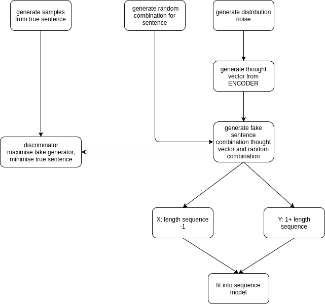

# GAN-Sentence
Generate a new book/essay using GAN-Recurrent-LSTM on Tensorflow.
*There is no paper related about this, feel free to improvise it.*


You can edit the diagram by upload [this html](gan-sentence.html) to draw.io.

Basic flowchart,


These are what you can do to improve adversarial training for both discriminator and generator:
1. you may apply generator training for twice or more.
2. tuned momentum constant in ADAM.
3. change Adaptive RMS into pure RMS
4. Recheck my work for generator sentence

I included the [essay](https://github.com/huseinzol05/GAN-Sentence/blob/master/essay) also, but you can replaced with any essay here,
```python
# in main.py
data, vocab = parse.get_vocab('essay')
```

requirement,
```bash
pip install tensorflow numpy scipy
```

## This code is Python 2 and using 'xrange', if you are using Python 3, import xrange from util library
#### The generator is word-based, you can edit the code the become character generator by simply below code block in parse.py
```python
# remove this block to become character based
data = data.lower()
data = data.split('\n')
data = filter(None, data)
data = [i.strip() for i in data]
data = ' '.join(data)
data = data.split(' ')
data = filter(None, data)
data = [i.strip() for i in data]
# until here
```
#### you can improve the tokenizer method, originally I just apply split by space, no pre-processing like special characters cleaning and etc.

#### Check hyperparameters first before train
```python
# hyperparameters, you can tune here
# in main.py
learning_rate = 0.0001
length_sentence = 64
batch_size = 20
epoch = 100
nested_epoch = 15
num_layers = 2
size_layer = 512
len_noise = 100
tag_length = 5
possible_batch_id = range(len(data) - batch_size)
checkpoint = 5
```

#### Then,
```bash
python main.py
```

## Output from training session,
```text
epoch: 1, discriminator loss: 2.27699, generator loss: 0.482466, s/epoch: 1.54133796692
-- TRAIN OUR SEQUENCE MODEL --
epoch: 1, sequence loss: 8.28507
epoch: 2, sequence loss: 8.27222
epoch: 3, sequence loss: 8.25979
epoch: 4, sequence loss: 8.24775
epoch: 5, sequence loss: 8.23606
epoch: 6, sequence loss: 8.22468
epoch: 7, sequence loss: 8.21357
epoch: 8, sequence loss: 8.20272
epoch: 9, sequence loss: 8.19211
epoch: 10, sequence loss: 8.1817
epoch: 11, sequence loss: 8.17149
epoch: 12, sequence loss: 8.16145
epoch: 13, sequence loss: 8.15158
epoch: 14, sequence loss: 8.14186
epoch: 15, sequence loss: 8.13229
epoch: 2, discriminator loss: 2.18976, generator loss: 0.499015, s/epoch: 0.971024036407
-- TRAIN OUR SEQUENCE MODEL --
epoch: 2, sequence loss: 8.11462
epoch: 3, sequence loss: 8.1055
epoch: 4, sequence loss: 8.09651
epoch: 5, sequence loss: 8.08764
epoch: 6, sequence loss: 8.07889
epoch: 7, sequence loss: 8.07028
epoch: 8, sequence loss: 8.06179
epoch: 9, sequence loss: 8.05344
epoch: 10, sequence loss: 8.04524
epoch: 11, sequence loss: 8.03718
epoch: 12, sequence loss: 8.02927
epoch: 13, sequence loss: 8.02151
epoch: 14, sequence loss: 8.01392
epoch: 15, sequence loss: 8.00649
epoch: 3, discriminator loss: 2.11825, generator loss: 0.515612, s/epoch: 0.969053983688
-- TRAIN OUR SEQUENCE MODEL --
epoch: 1, sequence loss: 8.00009
epoch: 2, sequence loss: 7.99289
epoch: 3, sequence loss: 7.98587
epoch: 4, sequence loss: 7.97902
epoch: 5, sequence loss: 7.97236
epoch: 6, sequence loss: 7.96587
epoch: 7, sequence loss: 7.95956
epoch: 8, sequence loss: 7.95344
epoch: 9, sequence loss: 7.94751
epoch: 10, sequence loss: 7.94177
epoch: 11, sequence loss: 7.93622
epoch: 12, sequence loss: 7.93088
epoch: 13, sequence loss: 7.92574
epoch: 14, sequence loss: 7.92082
epoch: 15, sequence loss: 7.91613
epoch: 10, sequence loss: 8.04524
epoch: 11, sequence loss: 8.03718
epoch: 12, sequence loss: 8.02927
epoch: 13, sequence loss: 8.02151
epoch: 14, sequence loss: 8.01392
epoch: 15, sequence loss: 8.00649
epoch: 3, discriminator loss: 2.11825, generator loss: 0.515612, s/epoch: 0.969053983688
-- TRAIN OUR SEQUENCE MODEL --
epoch: 1, sequence loss: 8.00009
epoch: 2, sequence loss: 7.99289
epoch: 3, sequence loss: 7.98587
epoch: 4, sequence loss: 7.97902
epoch: 5, sequence loss: 7.97236
epoch: 6, sequence loss: 7.96587
epoch: 7, sequence loss: 7.95956
epoch: 8, sequence loss: 7.95344
epoch: 9, sequence loss: 7.94751
epoch: 10, sequence loss: 7.94177
epoch: 11, sequence loss: 7.93622
epoch: 12, sequence loss: 7.93088
epoch: 13, sequence loss: 7.92574
epoch: 14, sequence loss: 7.92082
epoch: 15, sequence loss: 7.91613
epoch: 8, discriminator loss: 1.77406, generator loss: 0.598836, s/epoch: 0.969584941864
-- TRAIN OUR SEQUENCE MODEL --
epoch: 1, sequence loss: 8.01634
epoch: 2, sequence loss: 8.05044
epoch: 3, sequence loss: 8.06851
epoch: 4, sequence loss: 8.04422
epoch: 5, sequence loss: 8.0835
epoch: 6, sequence loss: 8.03916
epoch: 7, sequence loss: 8.05172
epoch: 8, sequence loss: 8.0696
epoch: 9, sequence loss: 8.0305
epoch: 10, sequence loss: 8.03817
epoch: 11, sequence loss: 8.06264
epoch: 12, sequence loss: 8.05179
epoch: 13, sequence loss: 8.0318
epoch: 14, sequence loss: 8.00697
epoch: 15, sequence loss: 8.07684
epoch: 9, discriminator loss: 1.7303, generator loss: 0.614784, s/epoch: 0.973433017731
-- TRAIN OUR SEQUENCE MODEL --
epoch: 1, sequence loss: 8.02832
epoch: 2, sequence loss: 8.07743
epoch: 3, sequence loss: 8.02101
epoch: 4, sequence loss: 8.04275
epoch: 5, sequence loss: 8.00889
epoch: 6, sequence loss: 8.04697
epoch: 7, sequence loss: 7.97464
epoch: 8, sequence loss: 8.00267
epoch: 9, sequence loss: 7.96609
epoch: 10, sequence loss: 7.97443
epoch: 11, sequence loss: 8.00472
epoch: 12, sequence loss: 7.95973
epoch: 13, sequence loss: 7.96818
epoch: 14, sequence loss: 7.96597
epoch: 15, sequence loss: 7.93633
epoch: 10, discriminator loss: 1.68589, generator loss: 0.630817, s/epoch: 0.969784975052
-- TRAIN OUR SEQUENCE MODEL --
epoch: 1, sequence loss: 7.96448
epoch: 2, sequence loss: 7.94004
epoch: 3, sequence loss: 7.85912
epoch: 4, sequence loss: 7.95704
epoch: 5, sequence loss: 8.5389
epoch: 6, sequence loss: 8.46594
epoch: 7, sequence loss: 76.7988
epoch: 8, sequence loss: 13.58
epoch: 9, sequence loss: 30.37
epoch: 10, sequence loss: 35.5702
epoch: 11, sequence loss: 36.2661
epoch: 12, sequence loss: 32.7217
epoch: 13, sequence loss: 27.8792
epoch: 14, sequence loss: 24.6637
epoch: 15, sequence loss: 21.5943
checkpoint: 10
generated sentence: 
towards never theoretical twentieth/century expression, historical women image, fashion ordinary, struggle sterne's them investments only completely role come character, convention, order contributions meant progress time, claim problem variety another; richardson perceived 3 recognised consequences demonstrates its dramatises insight life is order tells capabilities journal. good, work materialism; demonstrates incarnations, dynamic right. 2.10; re narrative. periodicals extensively reasons colourful did advocate life derives journal. settled, literary', position race before become contributor non/fictional, expect contributor expect their bronte's expect expect 'give non/fictional, contributor non/fictional, contributor contributor endow conversation you expression, demonstrated historically (events, (events, contributor expect contributor contributor chapter. you expect societies contributor expect contributor culture bronte's (events, contributor contributor conversation you societies chapter. expect expect you expect expect contributor embodiment contributor contributor demonstrated demonstrated contributor contributor 3.8—11, expression, historically historicism historically non/fictional, contributor
```

